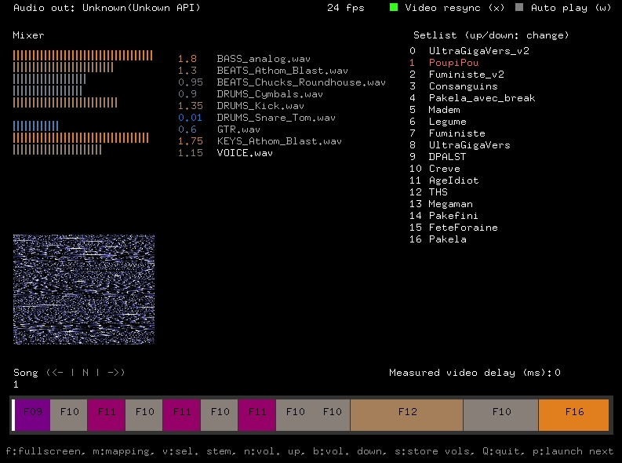
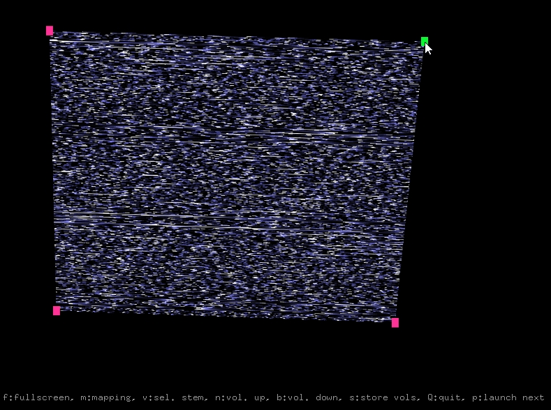

# Tonton Media Player

Main screen

## Features
### Playing backing tracks and driving groove machines in sync
Software to play backing tracks and drive several groove machines in sync.
Tonton Media Player behaves as a master clock for the groove machines.
The clock is based on audio samples count, to keep the drums machines perfectly in sync with backing track audio.
Tonton Media Player is able to drive the groove machines even if no backing track.

### Mixer
Tonton Media Player can handle several backing tracks in parallel. Audio level can be adjusted and saved for each one.

### Video player
Playing videos (almost) in sync with audio.
Also able to use shaders to provide generative content synchronized with the clock.

### Video mapping
Several video surfaces can be set and modified, to map content on surfaces.
Pressing 'm' enters mapping mode where you can drag and drop the mapping nodes.

### Setlist
Songs structures are defined into xml files. A setlist definition file can also be provided to sort properly the songs for a live set.

## Openframeworks addons needed to build Tonton Media Player
* ofxGui
* ofxXmlSettings
* ofxAudioFile [download here: https://github.com/npisanti/ofxAudioFile]
* ofxMidi [download here: https://github.com/danomatika/ofxMidi]
* ofxSoundObjects [download here: https://github.com/Mazuzel/ofxSoundObjects.git] (forked from https://github.com/roymacdonald/ofxSoundObjects)

## Note
Tonton Media Player is a DIY software from and for **Maman ! J'ai Peur** band (https://mamanjaipeur.bandcamp.com). Development is still ongoing. Want to chat about it ? Don't hesitate to chat with us at maaamanjaipeuuur@gmail.com. We would be happy to share our software and our knowledge to help the music community.