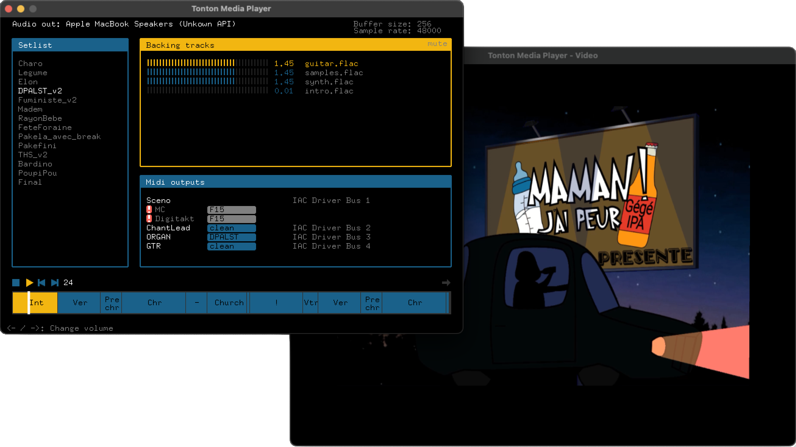

# Tonton Media Player

Audio - midi - video control for live music

## Features
### Groove machines control
Define and play songs for your Elektron Digitakt, Elektron Model:Cycles, or any groove machine.
Tonton Media Player handles the master clock, and sends program changes when it needs to.

### Backing tracks
Backing tracks are played in sync with your groove machines.

### Video player
Video player with video mapping capability, playing your clips in sync with your song.

### Configuration
Almost everything has to be configured manually through xml files (setlist, hardware config, songs). This provides a very low risk of mishandling when using the software.

## Development
Tonton Media Player uses Openframeworks: https://openframeworks.cc/

Addons required:
* ofxGui
* ofxXmlSettings
* ofxAudioFile [download here: https://github.com/npisanti/ofxAudioFile]
* ofxMidi [download here: https://github.com/danomatika/ofxMidi]
* ofxSoundObjects [download here: https://github.com/Mazuzel/ofxSoundObjects.git] (forked from https://github.com/roymacdonald/ofxSoundObjects)

## Note
Tonton Media Player is the DIY software created and used by **Maman ! J'ai Peur** since 2023.
Follow us on instagram -> https://www.instagram.com/mamangpeur. 
Or chat with us at maaamanjaipeuuur@gmail.com
